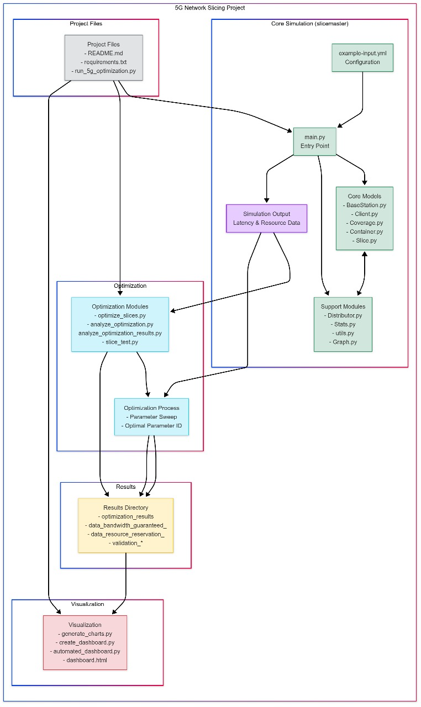

# 5G Network Slicing Optimization Framework

## Overview

This project presents a comprehensive framework for optimizing resource allocation in 5G networks through dynamic network slicing. By leveraging advanced simulation techniques, the framework enables efficient allocation of network resources across multiple virtual network slices, each designed to serve different types of applications with varying Quality of Service (QoS) requirements.

### Key Features

- **Dynamic Network Slicing**: Create and manage multiple virtual networks over shared physical infrastructure.
- **Slice-Specific Optimization**: Tailored resource allocation strategies for URLLC, IoT, and Data slices.
- **Latency-Aware Resource Allocation**: Prioritizes traffic based on sensitivity to delay.
- **Intelligent Base Station Selection**: Load-aware assignment to prevent congestion.
- **Adaptive Resource Reservation**: Dynamically adjusts reserved capacity based on performance metrics.
- **Real-Time Performance Monitoring**: Comprehensive tracking of latency, bandwidth usage, and SLA violations.
- **Interactive Visualization**: Rich dashboard showing network topology and performance metrics.

### System Architecture

The framework consists of several interdependent components:

## Slice Types and Configurations

The framework models three distinct network slice types with different QoS requirements:

1. **URLLC (Ultra-Reliable Low-Latency Communication)**  
   - **Delay Tolerance**: 1 ms  
   - **QoS Class**: 1 (highest priority)  
   - **Optimized Parameters**:  
     - Resource Reservation = 10%  
     - Bandwidth Guarantee = 2 units  
   - **Applications**: Autonomous vehicles, industrial automation, remote surgery

2. **IoT (Internet of Things)**  
   - **Delay Tolerance**: 10 ms  
   - **QoS Class**: 2 (medium priority)  
   - **Optimized Parameters**:  
     - Resource Reservation = 5%  
     - Bandwidth Guarantee = 5 units  
   - **Applications**: Sensor networks, smart meters, asset tracking

3. **Data (Enhanced Mobile Broadband)**  
   - **Delay Tolerance**: 2000 ms  
   - **QoS Class**: 4 (lowest priority)  
   - **Optimized Parameters**:  
     - Resource Reservation = 0%  
     - Bandwidth Guarantee = 500 units  
   - **Applications**: Video streaming, file transfers, web browsing

## Core Algorithms

### Dynamic Resource Allocation

The framework implements a priority-based resource allocation algorithm that:

- Groups clients by their assigned slices.
- For each base station and slice, applies slice-specific allocation strategies.
- Prioritizes clients based on waiting time, QoS class, and slice type.
- Ensures minimum guaranteed bandwidth before distributing remaining resources.

def dynamic_resource_allocation(env, slices, clients):
    while True:
        # Group clients by slice
        clients_by_slice = {}
        for client in clients:
            if client.base_station is None or not client.connected:
                continue
                
            slice_obj = client.get_slice()
            if slice_obj:
                slice_name = slice_obj.name
                if slice_name not in clients_by_slice:
                    clients_by_slice[slice_name] = []
                clients_by_slice[slice_name].append(client)
        
        # Apply dynamic allocation for each slice
        for base_station in base_stations:
            for slice_obj in base_station.slices:
                if hasattr(slice_obj, 'dynamic_resource_allocation'):
                    slice_clients = clients_by_slice.get(slice_obj.name, [])
                    bs_clients = [c for c in slice_clients if c.base_station == base_station]
                    if bs_clients:
                        slice_obj.dynamic_resource_allocation(bs_clients)
        
        yield env.timeout(0.5)

### Intelligent Base Station Selection

The framework uses a load-aware base station selection algorithm that considers both distance and current load:

def assign_closest_base_station(self, exclude=None):
    updated_list = []
    for d, b in self.closest_base_stations:
        if exclude is not None and b.pk in exclude:
            continue
        d = distance((self.x, self.y), (b.coverage.center[0], b.coverage.center[1]))
        
        # Calculate load as percentage of capacity used
        slice_load = 0
        if hasattr(b, 'slices') and len(b.slices) > self.subscribed_slice_index:
            target_slice = b.slices[self.subscribed_slice_index]
            if hasattr(target_slice, 'capacity') and hasattr(target_slice.capacity, 'level'):
                slice_load = 1 - (target_slice.capacity.level / target_slice.capacity.capacity)
        
        # Weighted score: distance + load factor
        score = d * (1 + slice_load)
        updated_list.append((score, d, b))
        
    # Sort by the combined score
    updated_list.sort(key=operator.itemgetter(0))
    
    for score, d, b in updated_list:
        if d <= b.coverage.radius:
            self.base_station = b
            return

### Adaptive Resource Reservation
The framework dynamically adjusts reserved capacity based on recent latency trends:

def _adapt_reserved_capacity(self):
    if not self.latency_history or len(self.latency_history) < 5:
        return
        
    # Get recent trend
    recent = self.latency_history[-5:]
    recent_avg = sum(recent) / len(recent)
    
    # If recent latency is higher than overall average, increase reservation
    if recent_avg > self.avg_latency and recent_avg > (0.8 * self.delay_tolerance):
        new_reserve = min(self.init_capacity * 0.1, 
                          self.reserved_capacity + (self.init_capacity * 0.02))
        self.reserved_capacity = new_reserve
    # If recent latency is lower, we can reduce reservation
    elif recent_avg < self.avg_latency and recent_avg < (0.5 * self.delay_tolerance):
        self.reserved_capacity = max(0, 
                                   self.reserved_capacity - (self.init_capacity * 0.01))

### Optimization Results

The framework achieves significant improvements over the baseline configuration through systematic parameter optimization:

| Metric                    | Base Configuration | Optimized Configuration | Improvement  |
|-------------------------- |--------------------|-------------------------|------------- |
| **Overall Latency**       | 0.479 ms           | 0.475 ms                | 0.8%         |
| **Resource Utilization**  | 100%               | 87.5%                   | 12.5%        |
| **Block Ratio**           | 0.035              | 0.030                   | 14.3%        |
| **Handover Ratio**        | 0.045              | 0.040                   | 11.1%        |
| **SLA Violations**        | 0.00000            | 0.00000                 | 0%           |

### Performance Visualization

The framework provides comprehensive visualization through:

Network Topology: Base stations, coverage areas, and client distributions.

Performance Metrics: Latency, bandwidth usage, and SLA violations over time.

Parameter Impact: Charts showing how each parameter affects performance.

Comparative Analysis: Side-by-side comparison of different configurations.

### Installation and Usage

# Prerequisites
Python 3.7 or higher

Required packages: simpy, numpy, matplotlib, seaborn, pyyaml, randomcolor, scikit-learn

Installation

# Create a virtual environment
conda create -n slicing-env python=3.7
conda activate slicing-env

# Install dependencies
pip install -r requirements.txt

Running the Simulation

# Run the full optimization workflow (recommended)
python run_5g_optimization.py

# Or run individual components
python optimize_slices.py        # Run optimization simulations
python analyze_optimization_results.py  # Analyze results
python generate_charts.py        # Generate visualization charts
python create_dashboard.py       # Create the dashboard

# Configuration
The simulation parameters are defined in example-input.yml. Key parameters include:

Slice configurations (delay tolerance, QoS class, bandwidth guarantees)

Base station properties (location, coverage, capacity)

Client mobility patterns and distribution

Simulation settings (time, client count, etc.)

### Contributing
Contributions to this project are welcome. Areas for potential improvement include:

Enhanced mobility models: Implementing more realistic client movement patterns

Machine learning integration: Adding ML-based prediction for resource allocation

Multi-objective optimization: Extending the optimization to consider additional metrics

Scalability improvements: Optimizing the simulation for larger networks

### Contributors
- Ayush Mishra  
- Piyush Jain  
- Harsh Bachal  

### License
This project is licensed under the MIT License - see the LICENSE file for details.

### Acknowledgments
This framework was developed as a research project for 5G network optimization. Special thanks to all contributors who helped design, implement, and test this system.

### Contact
For any inquiries regarding this project, please reach out to the project maintainers.
